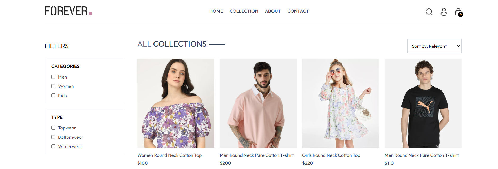
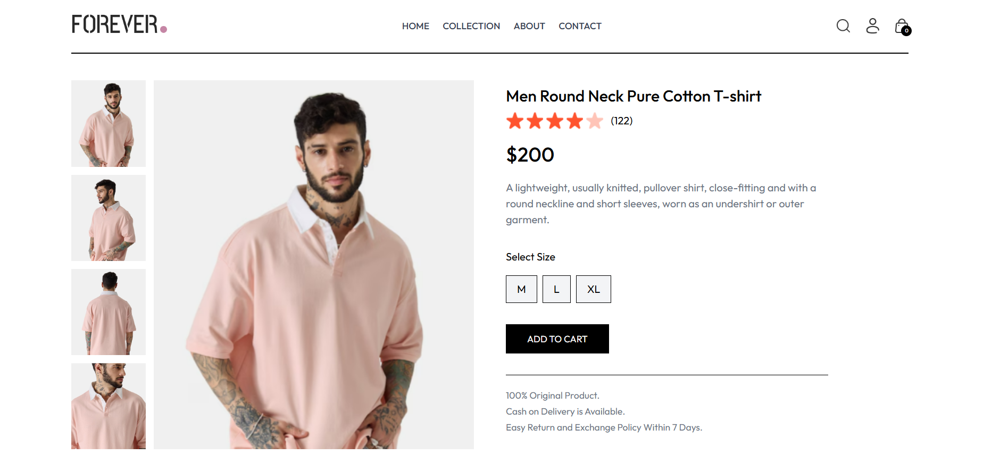
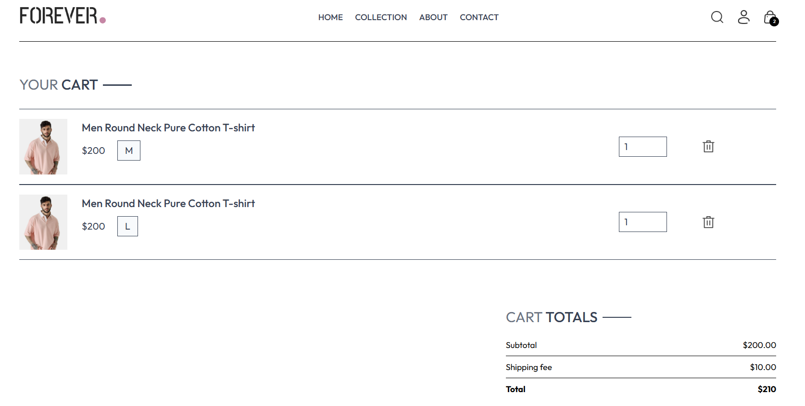
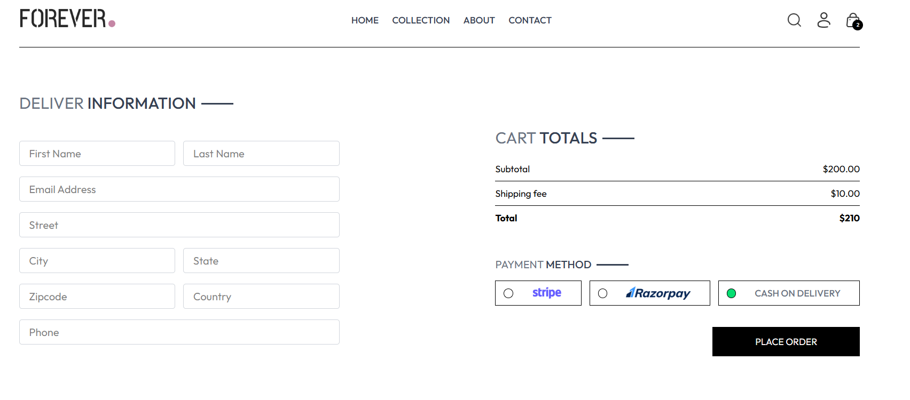
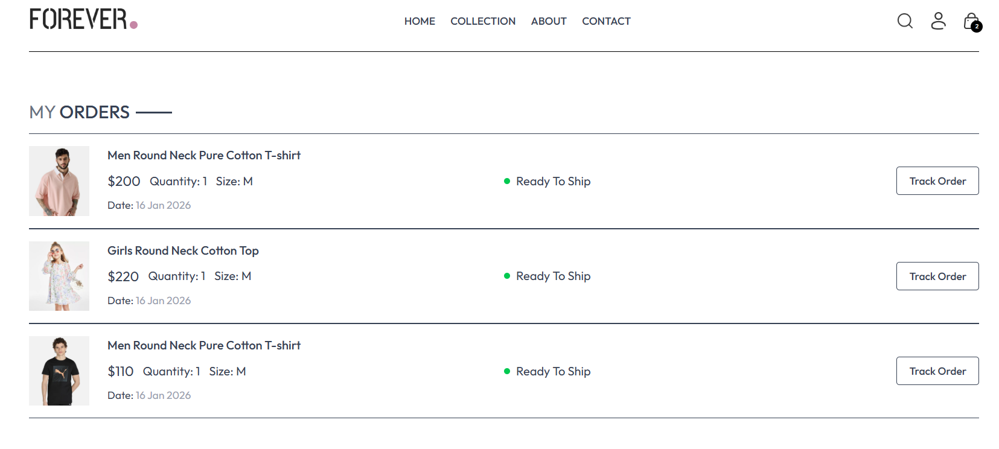
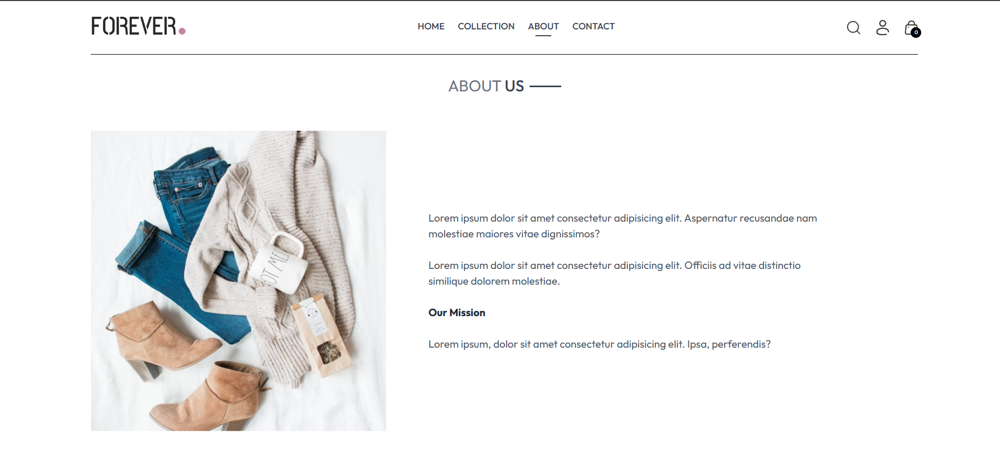
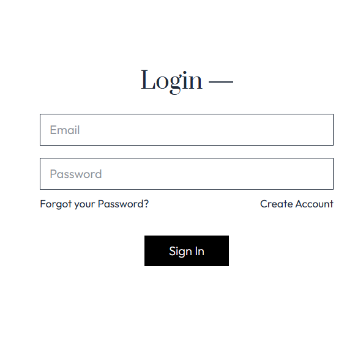

## E-Commerce Website (Front-End)

An interactive E-Commerce Web Application Front-End built with React and Tailwind CSS, designed to provide a smooth and user-friendly shopping experience. The application demonstrates modern front-end development practices such as component-based architecture, state management, dynamic rendering, and responsive design.

## Features

Responsive Design: Optimized for desktops, tablets, and mobile devices.

Product Listing & Filtering: Display all products with category filters and search functionality.

Product Details Page: View detailed information, images, and available variants for each product.

Shopping Cart: Add/remove items, view cart summary, and calculate total dynamically.

Checkout Form: Basic checkout form with validation for user input.

Dynamic Navigation: Easily navigate between categories, product pages, and cart.

State Management: Uses React Context API to manage global state.

Currency Support: Dynamically display product prices in different currencies.

Reusable Components: Buttons, cards, modals, and headers built as reusable components.

## Screenshots

## Tech Stack

Frontend: React (Functional Components, Hooks)

Styling: Tailwind CSS

Routing: React Router

State Management: Context API

Package Manager: npm 

## Project Structure
ecommerce-frontend/
│
├─ public/               # Public assets
├─ src/
│  ├─ assets/            # Images, icons, and other media
│  ├─ components/        # Reusable UI components
│  ├─ pages/             # Main pages (Home, Product, Cart, etc.)
│  ├─ Context/           # Context API for state management
│  ├─ App.js             # Main app component
│  └─ index.js           # Entry point
└─ package.json

## Installation & Setup

Clone the repository:
git clone https://github.com/ayushasunuwar/E-commerce

Navigate to the project directory:
cd Frontend

Install dependencies:
npm install

Run the development server:
npm run dev